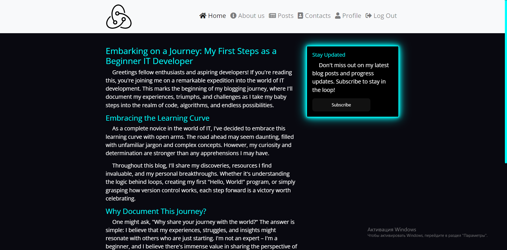
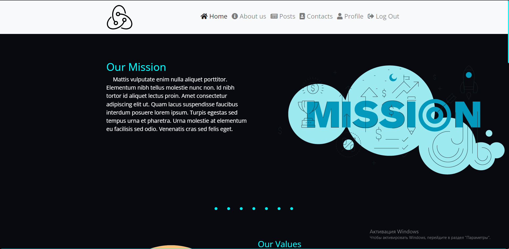
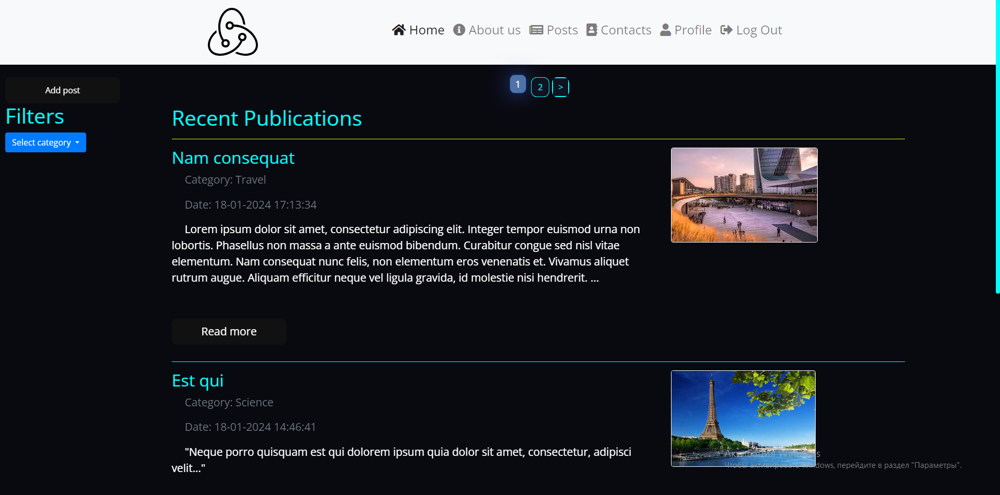
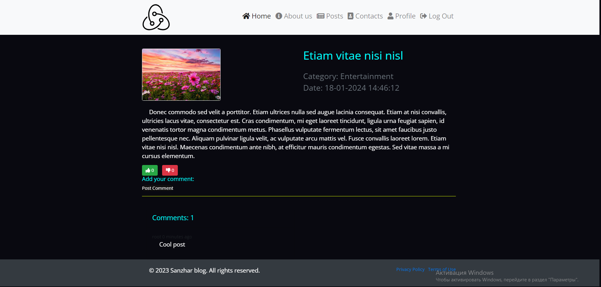
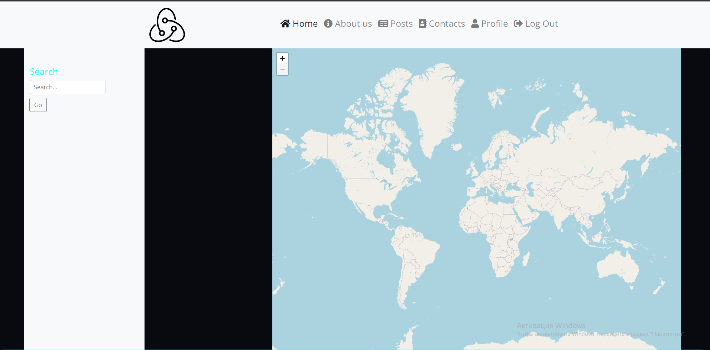
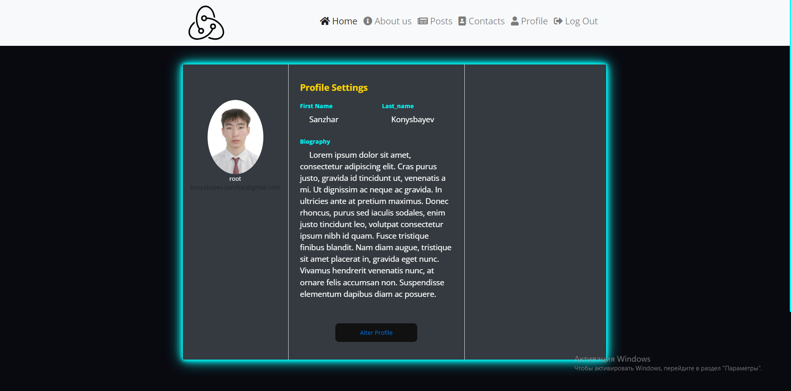
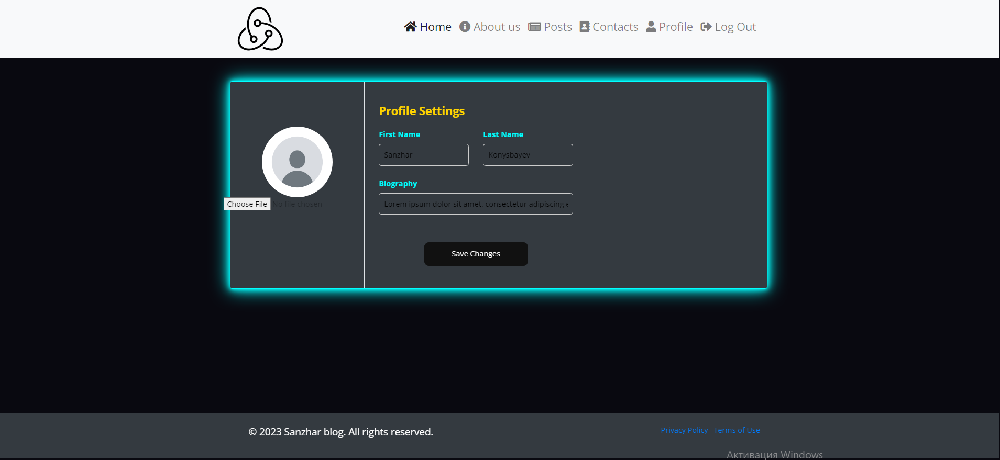
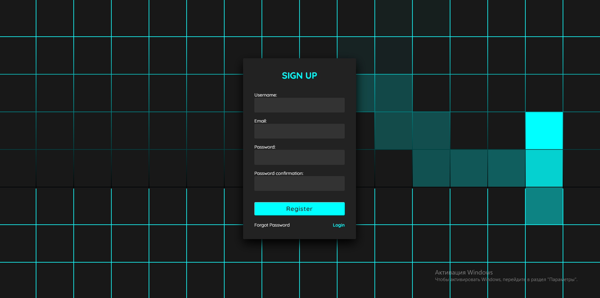
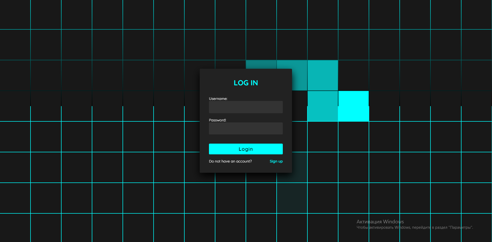

Project name: blog

Description:
This is a blog website

Author: Konysbayev Sanzhar
Installation:
1) Clone repository:
    mkdir <project name>
    cd <project name>
    git clone https://github.com/snazh/blog .

2) Set Up a Virtual Environment
    python -m venv venv
    .\venv\scripts\activate
3) Install dependencies:
    pip install -r requirements.txt
4) Launch Local Server:
    python manage.py runserver
   (superuser: root, password: 10112005)

Review:

1)Home page

2)About us page 

3)Post page 

4)Post details page 

5)Raw contacts form 

6)User profile page 

7)Update User profile page 

8)Registration page 

9)Log in page 

P.S please do not manipulate with AWS and Django keys.